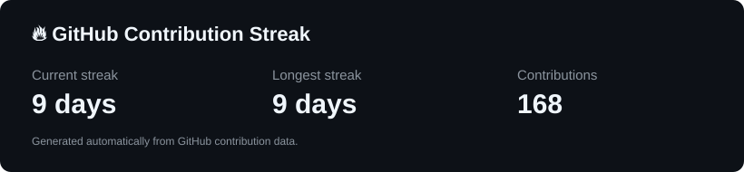
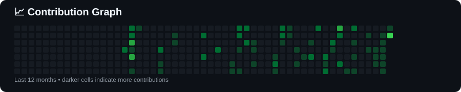

<h1 align="center">Hi 👋, I'm Ashmeer Raza</h1>

<p align="center">
  <b>Software Engineer</b>
</p>

<p align="center">
  Building web applications, learning new technologies.
</p>

<p align="center">
  <a href="https://github.com/ashmeer-raza">
    
  </a>
  <a href="https://www.linkedin.com/in/ashmeer-raza-563b1a284/">
    
  </a>
</p>

---

## 👨‍💻 About Me

* 🎓 Bachelor of Engineering in **Computer Engineering**
* 🏫 Savitribai Phule Pune University — **2025**
* 👨‍🏫 Currently working as a **Lecturer**
* 💻 Previously worked as a **Software Engineer**
* 🌐 Interested in **Full Stack Development, System Design & AI/ML**
* ⚛️ Building applications with **React.js, Next.js and JavaScript**
* 🟢 Working with **Node.js, Express.js, REST APIs and Databases**
* 🧠 Strong interest in **DSA, OOP and Problem Solving**
* 🚀 Continuously learning and building practical projects

---

# 💼 Experience

### 👨‍🏫 Lecturer

**Maulana Mukhtar Ahmad Nadvi Technical Campus**
*July 2026 – Present*

* Teaching and mentoring engineering students in programming and computer science.
* Conducting lectures and practical sessions on **Data Structures & Algorithms, OOP and Computer Graphics**.
* Using hands-on assignments, debugging exercises and project-based learning.
* Helping students improve programming logic and structured problem-solving skills.
* Connecting programming concepts with real-world software development practices.

### 💻 Web Development Intern

**Mindtrail Technologies**

Worked on modern web applications using:

* React.js
* Next.js
* JavaScript
* Tailwind CSS
* REST APIs

Focused on building responsive user interfaces, reusable components, API integration and performance improvements across desktop and mobile devices.

---

# 🚀 Featured Projects

### 💰 Fake Currency Detection Using Deep Learning

A final-year AI/ML project for detecting fake currency using deep learning and CNN architectures.

**Technologies:**
`Python` `TensorFlow` `CNN` `VGG16` `VGG19` `MobileNet` `ResNet`

---

### 🔐 Authentication & Product CRUD APIs

A full-stack application implementing authentication and product CRUD functionality with frontend and backend integration.

**Technologies:**
`React.js` `Node.js` `Express.js` `MongoDB` `REST API`

---

### 📝 Notes App

A customized notes application with a modern interface and smooth animations.

**Technologies:**
`React.js` `Tailwind CSS` `Framer Motion`

---

### 📊 Event Chart

A web application for managing and displaying events with database integration.

**Technologies:**
`Node.js` `Express.js` `MySQL` `EJS` `Bootstrap`

---

### 🕌 Divine Pearls

A web-based Islamic content project containing duas and ziyarat information.

**Technologies:**
`React.js` `JavaScript` `Web Development`

---

### ⚛️ React Mini Projects

A collection of React projects created while learning and practicing React concepts.

🔗 [React Mini Project](https://github.com/ashmeer-raza/React-Mini-Project)

---

### 📡 Data Fetching with React

A project focused on fetching and displaying API data using React.

🔗 [Data Fetching with React](https://github.com/ashmeer-raza/Data-Fetching-with-React)

---

### 🛒 Amazon Web Clone

A frontend e-commerce website inspired by Amazon, developed to practice modern frontend development and responsive UI design.

**Technologies:**
`React.js` `JavaScript` `CSS` `HTML`

🔗 [View Repository](https://github.com/meer7202/Amazon-Web-Clone)

---

# 🧰 Tech Stack

## Languages


## Frontend


## Backend


## Databases


## State Management & Libraries


## Data Science & AI/ML


## Tools


---

# 🧠 Core Computer Science

* Data Structures & Algorithms
* Object-Oriented Programming
* Problem Solving
* Database Management
* REST API Development
* Authentication & Authorization
* Web Development
* Software Development Practices

---

# 📚 Currently Learning

```text
Node.js
   ↓
Express.js
   ↓
REST APIs
   ↓
Authentication & Authorization
   ↓
MongoDB / MySQL
   ↓
Deployment
   ↓
System Design
```

Currently focusing on becoming stronger in **backend development, full-stack development and scalable web applications**.

---

# 💻 Coding Philosophy

```javascript
while (learning) {
    build();
    practice();
    solveProblems();
    improve();
}
```

> "Build projects. Break things. Fix them. Learn. Repeat."

---

# 📊 GitHub Stats

<p align="center">
  
  
</p>


<p align="center">
  
</p>


<p align="center">
  
</p>

---

# 🤝 Let's Connect

I'm interested in opportunities related to:

* 💻 Software Engineering
* 🌐 Full Stack Development
* ⚛️ React.js Development
* 🟢 Node.js Development
* 🤖 AI/ML Development
* 🚀 Web Development


## 🐍 Contribution Snake

<p align="center">
  
</p>

<p align="center">
  ⭐ Feel free to explore my repositories and projects.
</p>

<p align="center">
  <b>Thanks for visiting my GitHub profile! 👋</b>
</p>
